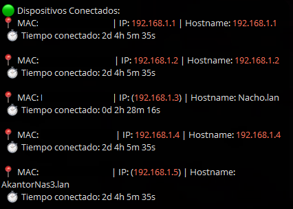

# NmapTelegramScan
# Monitoreo de Dispositivos de Red con Telegram

Este proyecto es un script en Python que utiliza `nmap` para escanear una red local y notificar sobre el estado de los dispositivos (conectados y desconectados) a través de Telegram. Ideal para administradores de redes y entusiastas que desean monitorear la presencia de dispositivos en su red de forma automatizada.

## Clonar el Repositorio

Para comenzar a trabajar con el proyecto, primero necesitas clonar el repositorio a tu máquina local. Aquí tienes los pasos a seguir:

1. **Abre tu Terminal o Línea de Comandos**:
   - En **Windows**, puedes usar Git Bash o el símbolo del sistema (CMD).
   - En **macOS** o **Linux**, abre la Terminal.

2. **Navega al Directorio Deseado**:
   - Antes de clonar el repositorio, asegúrate de estar en el directorio donde quieres que se guarde el proyecto. Usa el comando `cd` para cambiar de directorio. Por ejemplo:

     ```sh
     cd /ruta/a/tu/directorio
     ```

3. **Clona el Repositorio**:
   - Ejecuta el siguiente comando para clonar el repositorio desde GitHub:

     ```sh
     git clone https://github.com/FalconAkantor/NmapTelegramScan.git
     ```

4. **Accede al Directorio del Repositorio**:
   - Una vez que el repositorio esté clonado, entra en el directorio del proyecto con:

     ```sh
     cd NmapTelegramScan
     ```

## Funcionalidades

- **Escaneo de Red**: Detecta dispositivos activos en la red usando `nmap`.
- **Monitoreo de Estado**: Realiza un seguimiento del estado de conexión y desconexión de cada dispositivo.
- **Notificaciones de Telegram**: Envía notificaciones en tiempo real a través de Telegram con el estado actual de los dispositivos documentada por dias, horas, minutos y segundos.
- **Actualización Periódica**: Actualiza el estado y las notificaciones en intervalos configurables.

## Requisitos

### Requisitos del Sistema

1. **Python**: Este script requiere Python 3.6 o superior.
2. **nmap**: Una herramienta de escaneo de redes. Debe estar instalada en tu sistema.

#### Instalación de `nmap`

- **En Windows**:
  1. Descarga el instalador desde la [página oficial de nmap](https://nmap.org/download.html).
  2. Ejecuta el instalador y sigue las instrucciones.

- **En macOS**:
  - Usa Homebrew. Si no tienes Homebrew, instálalo desde [aquí](https://brew.sh/), luego instala `nmap` con:

    ```sh
    brew install nmap
    ```

- **En Linux (Debian/Ubuntu)**:
  - Abre una terminal y ejecuta:

    ```sh
    sudo apt-get update
    sudo apt-get install nmap
    ```

- **En Linux (CentOS/RHEL)**:
  - Utiliza `yum` o `dnf`:

    ```sh
    sudo yum install nmap
    ```

    o

    ```sh
    sudo dnf install nmap
    ```

### Requisitos de Python

El script requiere la librería `requests` para interactuar con la API de Telegram. Puedes instalarla junto con otras dependencias en el archivo `requirements.txt`.

#### Instalación de Dependencias

1. Crea un archivo `requirements.txt` en el directorio del proyecto con el siguiente contenido:

    ```plaintext
    requests
    ```

2. Instala las dependencias con:

    ```sh
    pip install -r requirements.txt
    ```

## Configuración

### Archivo `config.json`

Crea un archivo llamado `config.json` en el mismo directorio que el script con el siguiente contenido:

```json
{
    "TELEGRAM_TOKEN": "TU TOKEN",
    "CHAT_ID": "TU ID",
    "NETWORK_RANGE": "192.168.1.0/24",
    "UPDATE_INTERVAL": 300
}
```

## Ejecución del Script

Para ejecutar el script, asegúrate de tener todos los requisitos instalados y configura tu archivo `config.json` correctamente. Luego, ejecuta el script con:

```sh
python3 nmap.py
```
## Como se ven las conexiones, tapando mis MACs:



## Como se ven las desonexiones, tapando mis MACs:


## Automatización con `crontab`

Para ejecutar automáticamente el script en intervalos regulares, puedes usar `crontab` en sistemas basados en Unix (como Linux y macOS). Aquí te explicamos cómo configurarlo:

### Configuración de `crontab`

1. **Abrir el archivo de configuración de `crontab`**:
   
   Abre una terminal y edita el archivo de configuración de `crontab` con el siguiente comando:

   ```sh
   crontab -e
   ```
   
2. **Configuración interna en `crontab`**:

```
@reboot /usr/bin/python3 /ruta/al/script/nmap.py
```


